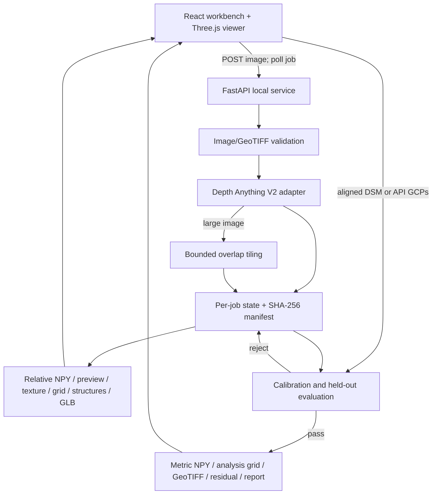
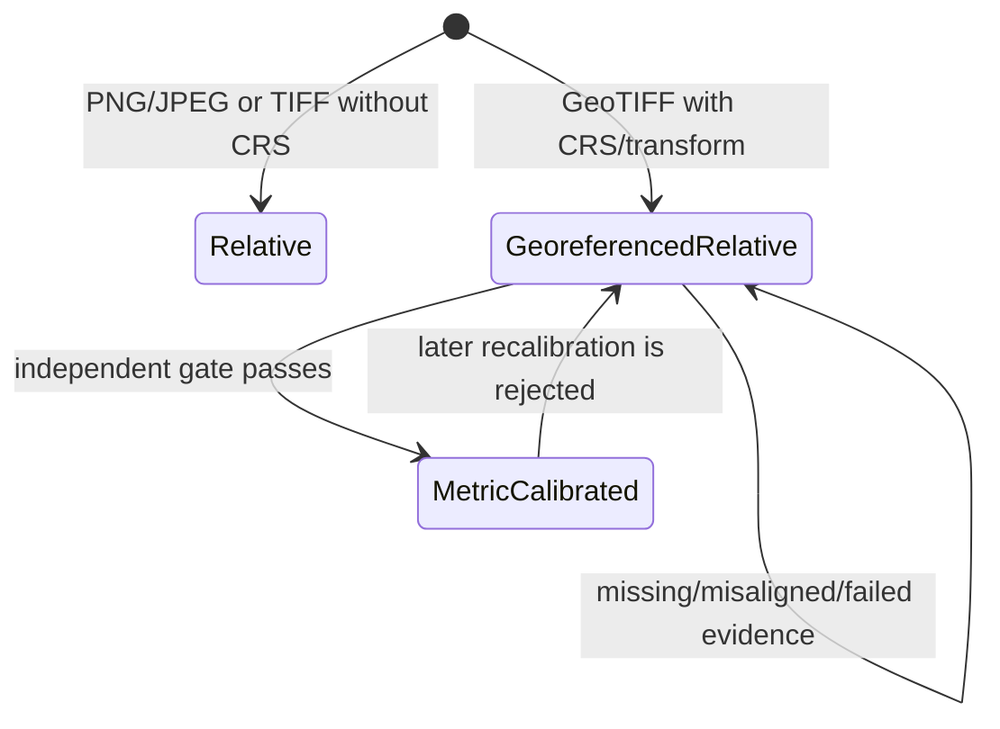
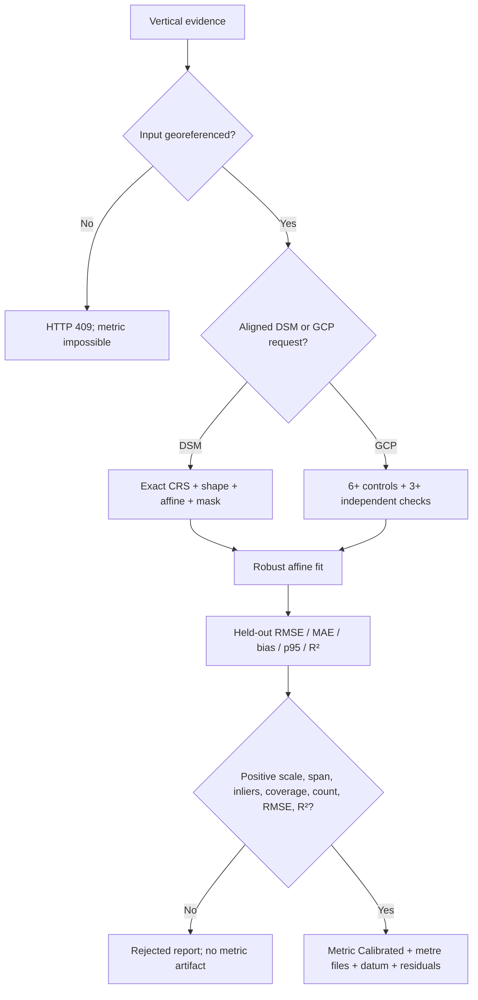

# TerraFly architecture and evidence map

## Runtime system

## Scientific state machine

Metric artifacts are a consequence of the state, not a UI toggle. The viewer/GLB display geometry remains normalized in every state; after a pass, point inspection samples the separate metric analysis grid. The optional Structures layer is visual only and never changes scientific state or DSM values.

## Calibration decision

## Ownership map

| Concern | Primary files | What the owner must explain |
|---|---|---|
| API and state | `main.py`, `schemas.py`, `jobs.py` | routes, typed states, persistence, safe artifact lookup |
| Image/geospatial | `imaging.py`, `calibration.py` | CRS versus vertical datum, masks, exact alignment, gates |
| Inference | `depth_anything_v2.py`, `tiling.py`, `factory.py` | relative model, real/test split, CUDA fallback, overlap alignment |
| Artifacts | `artifacts.py`, `pipeline.py` | why each file exists, GLB limits, hashes, orientation |
| 3D/UI | `App.tsx`, `SurfaceViewer.tsx`, `surfaceGeometry.ts` | progress, scientific labels, navigation, relative/metric A/B samples, optional structures, responsive design |
| Release/evidence | `verify.ps1`, `package_release.ps1`, `handoff/` | tests, clean extraction, checksums, limitations, reproducibility |

The complete tracked-file explanation is in `FILE_GUIDE.md`.
