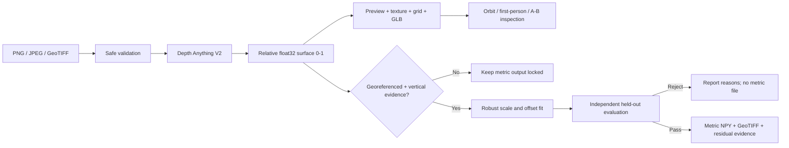

# TerraFly cookbook

Version 1.0 · final four-day build · 2026-08-25

This cookbook explains what was built, why every major part exists, how the scientific safeguards work, and how the team can defend an AI-assisted implementation honestly.

## The dish in one sentence

TerraFly turns one optical image into a traceable **relative** 3D surface, then creates separate metric elevation files only when independent vertical evidence passes robust held-out quality gates.

## Problem being solved

Satellite and aerial images are flat projections. People can visually recognize relief, buildings, vegetation, and near/far ordering, but one uncalibrated image cannot prove elevation in metres. TerraFly provides useful 3D inspection without pretending the pretrained monocular model is a survey instrument.

The application has three scientific states:

1. **Relative:** normal PNG/JPEG/TIFF without CRS; values are normalized 0–1.
2. **Georeferenced Relative:** GeoTIFF CRS/transform are known horizontally, but vertical scale/datum are still unknown.
3. **Metric Calibrated:** an aligned DSM or independent GCP controls/checks passed the declared quality gate; separate metric artifacts exist.

## Ingredients

| Ingredient | Job in TerraFly |
|---|---|
| FastAPI + Pydantic | Typed upload, job, calibration, artifact, and error contracts |
| Pillow + Rasterio | Safe image decoding and honest geospatial metadata/mask handling |
| NumPy | Full-resolution float32 relative and metric arrays |
| Depth Anything V2 Small | Real pretrained relative monocular depth baseline |
| PyTorch + Transformers | CUDA/CPU model execution and checkpoint loading |
| React + TypeScript | Professional stateful workbench and typed API client |
| Three.js | Textured 3D mesh, orbit, free flight, wireframe, and raycast points |
| Pytest + Vitest | Fast repeatable safety, science, orientation, and interaction proof |
| SHA-256 manifests | Exact input/artifact/release integrity evidence |

## Recipe overview



## Step 1 — inspect before decoding

`backend/terrafly/imaging.py` checks the filename, extension, byte limit, dimensions, pixel count, corrupt data, and decompression-bomb conditions. PNG/JPEG contents must match their extension. GeoTIFF reads bands, masks, CRS, affine transform, bounds, and NoData.

Single-band data is repeated into RGB only so the optical model can execute. The result receives a TIR/out-of-domain warning. Execution is not validation.

## Step 2 — estimate relative structure

`backend/terrafly/inference/depth_anything_v2.py` loads `depth-anything/Depth-Anything-V2-Small-hf`, records its revision, prefers CUDA, and recovers on CPU after CUDA out-of-memory. The raw prediction is robustly normalized and inverted into a visually intuitive 0–1 relative surface.

Large images use `inference/tiling.py`. Overlapping crops cannot be normalized independently because monocular depth has arbitrary scale and offset. TerraFly aligns tile overlaps with a positive affine relation, feather-blends them, and normalizes only the complete surface. Tile count and memory are bounded.

The deterministic adapter exists only for fast offline tests. It requires an explicit safety flag and writes `TEST-ONLY` into the result.

## Step 3 — preserve different kinds of evidence

| Runtime artifact | Why it exists |
|---|---|
| `relative_surface.npy` | Lossless full-resolution float32 0–1 source for computation |
| `relative_preview.png` | Human-readable colorized quality check |
| `texture.png` | RGB convention actually used by the model/viewer |
| `relative_height_16bit.png` | Higher-precision display/interchange texture |
| `relative_grid.json` | Downsampled orientation-aware browser mesh data |
| `relative_surface.glb` | Portable colored GLB 2.0 inspection mesh; explicitly non-metric |
| `job_manifest.json` | Input/model/device/warnings/configuration/artifact hashes |
| `calibration_reference.tif` | Exact reference evidence retained for audit |
| `calibration_report.json` | Fit, held-out metrics, gates, source, datum, and decision |
| `metric_surface.npy` | Full-resolution calibrated float32 metres after a pass |
| `metric_surface.tif` | GIS-ready metric raster with source CRS/grid/NoData and vertical tags |
| `calibration_error.tif` | Candidate elevation minus aligned reference in metres |

The `.npy` files from the related SAC IR-colorization repository are not missing TerraFly model files. They contain TIR super-resolution/colorization arrays, not DSM/DTM/height truth. TerraFly’s own `.npy` outputs contain relative or gated metric numeric surfaces.

## Step 4 — build the 3D plate

`frontend/src/surfaceGeometry.ts` maps row 0 to image top and column 0 to image left, builds triangles, UV coordinates, and bilinear point samples. `SurfaceViewer.tsx` owns WebGL rendering and navigation.

- Orbit is for whole-scene inspection and A/B raycast samples.
- First-person is free flight: mouse look, W/A/S/D, Q/E vertical movement, Shift boost, and Escape release.
- Texture and Wireframe reveal two interpretations of the same geometry.
- Vertical exaggeration changes display vertices only; it never changes the saved numeric array.
- The GLB uses the responsive grid and embedded vertex colour. It is portable but not full-resolution or metric.

## Step 5 — calibrate without cheating

TerraFly fits:

```text
elevation_metres = scale × relative_surface + offset
```

For an aligned reference DSM:

1. CRS, width, height, and affine grid must match exactly.
2. Source and reference NoData are excluded.
3. A spatial checkerboard subset is hidden before fitting.
4. Training pixels are bounded to 50,000 and robust outliers are clipped.
5. Only the untouched spatial subset produces evaluation metrics.

For GCP calibration, at least six controls fit the relation and at least three separate validation points judge it. Bilinear sampling maps fractional pixel coordinates onto the relative array. GCPs touching source NoData are refused.

Metric output remains locked unless all applicable gates pass:

- positive scale;
- at least 0.05 relative-value span;
- at least 75% training inliers;
- at least 40% coverage on both image axes;
- enough held-out observations;
- held-out RMSE no larger than the declared limit;
- held-out R² at least 0.50.

Reported diagnostics include RMSE, MAE, bias, median absolute error, p95 absolute error, R², scale, offset, counts, inlier ratio, coverage, thresholds, and failure reasons.

## Step 6 — evaluate the right claim

The bundled calibration demo is intentionally circular: its reference equals `40 × model_relative + 100` with training-only outliers. Near-zero held-out error proves the software recovers a known relation and keeps fit/evaluation separate. It does **not** prove real-world height accuracy.

Real evaluation needs independently surveyed, co-registered height truth with a known vertical datum, valid masks, spatially independent scenes, and a threshold chosen for the application. SRTM is too coarse to validate individual buildings/trees and was not silently added.

## Step 7 — serve and verify

`scripts/setup.ps1` creates the local Python environment, installs the exact npm lockfile, and builds the production interface. `Start-TerraFly.cmd` launches a single local FastAPI service that serves both API and prebuilt UI at `127.0.0.1:8000`. Development mode can still use Vite when `frontend/dist` is absent.

`Check-TerraFly.cmd` runs the fast release gate. `scripts/verify.ps1 -Full` adds the real end-to-end CUDA/CPU calibration smoke. `scripts/package_release.ps1` creates source and Windows release archives plus SHA-256 checksums.

## What the tests protect

- unsafe/corrupt/wrong/empty/oversized files;
- pixel and working-memory limits;
- deterministic-adapter production interlock;
- GeoTIFF CRS/transform/NoData without false vertical claims;
- tile coverage/alignment/blending/refusal;
- GLB container, geometry, colour, orientation, and non-metric metadata;
- viewer top/left orientation and point sampling;
- completed-job cleanup path safety;
- exact calibration alignment;
- robust outlier recovery;
- poor-evidence rejection with no metric artifacts;
- independent GCP validation;
- source NoData preservation;
- production frontend serving without a Vite server;
- every declared artifact hash.

## How to answer “Did AI make this?”

Say: “Yes, we used AI-assisted development. We can trace the complete request flow, explain every scientific gate, run the tests, identify which model is real versus test-only, and show why metric files are absent until independent validation passes. We own the decisions and evidence.”

Do not pretend every line was typed manually. Judges are more likely to trust a team that can explain limitations, reproduce results, and repair failures than one that denies obvious tooling.

## What not to claim

- Do not call an uncalibrated PNG result elevation, DSM, terrain height, or metres.
- Do not call A/B relative difference a distance, slope, or building height.
- Do not call the SAC thermal/colorization `.npy` files elevation labels.
- Do not present the bundled synthetic reference’s near-zero RMSE as model accuracy.
- Do not imply the GLB is full-resolution surveyed geometry.
- Do not hide a rejected calibration report or force a metric file.

## Where to learn each part

- `docs/OPERATOR_GUIDE.md`: exact usage, drone controls, checks, troubleshooting.
- `docs/ARCHITECTURE.md`: system/state/evidence diagrams and ownership map.
- `docs/JUDGE_QA.md`: concise defensible answers.
- `docs/DEMO_SCRIPT.md`: timed final presentation flow.
- `FILE_GUIDE.md`: why every tracked file exists.
- `DECISIONS.md`: why important technical choices were made.
- `LIMITATIONS.md`: boundaries that must remain visible.
- `RESULTS.md`: measured verification evidence.
- `handoff/FINAL_TEST_REPORT.md`: final release test ledger.
